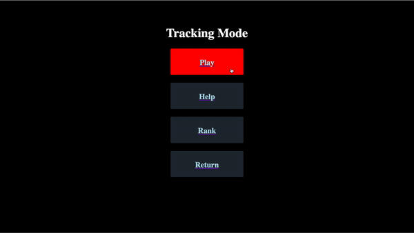

## Aim Trainer

Web app based on [React](https://reactjs.org/) & [Firebase](https://firebase.google.com/) to practice aiming skills for [FPS games](https://en.wikipedia.org/wiki/First-person_shooter). There is a ranking system so if you break the records, remember to type your name and submit!

There are 3 different modes for practicing different skills:
1. [Aiming Mode](#Aiming)
2. [Tracking Mode](#Tracking)
3. [FPS Mode](#FPS)
  
  
***
### [Aiming Mode](#Aiming)

Practice for moving your pointer more accurate!

Here is a demo:

***
### [Tracking Mode](#Tracking)

Practice for keeping track of your moving enemy!

Here is a demo:

***
### [FPS Mode](#FPS)

FPS simulation!

Here is a demo:

### TODO:

1. FPS mode has a little lag, maybe there is a better way to fix that.
2. Make the UI nicer
